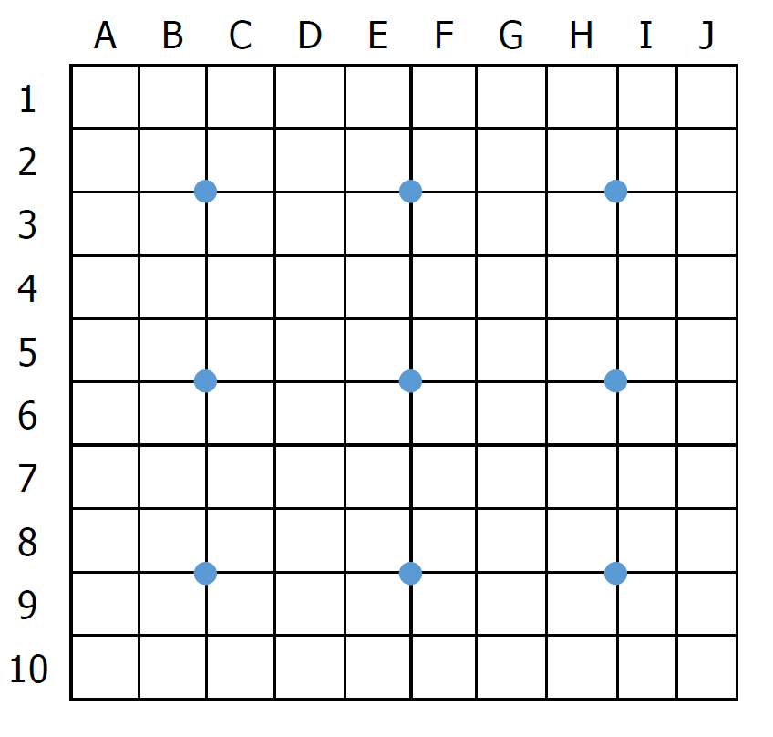

\setcounter{page}{1}

<style>
body {
text-align: justify;
font-size: 12pt;
}
</style>

```{r global_options, include = FALSE}
# Set global chunk options
rm(list = ls()) ### to clear namespace

library(knitr)

opts_chunk$set(fig.width = 9, fig.height = 7, fig.align = 'center',
               echo = FALSE, warning = FALSE, message = FALSE)

# set the chunk cache option to TRUE
# knitr::opts_chunk$set(cache = TRUE)

```

```{r, include = FALSE}

# load packages
library(tidyverse)
library(factoextra)
library(lme4)
library(ggeffects)
library(MuMIn)
library(AICcmodavg)
library(broom.mixed)
library(ggpubr)
library(patchwork)
library(kableExtra)
library(sf)
library(rnaturalearth)
library(flextable)
library(DHARMa)


### load data
df_species_conspicuousness <- read_csv2(file = "./data/raw/data_species_conspicuousness.csv", col_names = TRUE)
df_data_experimenter_before_filtering <- read_csv2(file = "./data/tidy/df_data_experimenter_before_filtering.csv", col_names = TRUE)
df_data_participant_before_filtering <- read_csv2(file = "./data/tidy/df_data_participant_before_filtering.csv", col_names = TRUE)
df_data_experimenter <- read_csv2(file = "./data/tidy/df_data_experimenter.csv", col_names = TRUE)
df_3_methods <- read_csv2(file = "./data/tidy/df_3_methods_3_without_excess_detections.csv")

# convert time measures from seconds to minutes
df_3_methods$counting_time <- df_3_methods$counting_time/60

# add columns to code manually the interaction counting_time * counting_method without estimating a slope for count_30s
counting_time_1m <- df_3_methods$counting_time
counting_time_1m[which(df_3_methods$counting_method == "count_30s" | df_3_methods$counting_method == "count_cells")] <- 0
counting_time_cells <- df_3_methods$counting_time
counting_time_cells[which(df_3_methods$counting_method == "count_30s" | df_3_methods$counting_method == "count_1m")] <- 0
df_3_methods <- cbind(df_3_methods, counting_time_1m, counting_time_cells)

# set the counting method count_30s as reference level
df_3_methods$counting_method <- factor(df_3_methods$counting_method, levels = c("count_30s", "count_1m", "count_cells"))

# add a column with a unique quadrat ID
df_3_methods <- cbind(df_3_methods, quadrat_id = paste0(df_3_methods$species, "_", df_3_methods$quadrat_num))

# convert to tibble
df_3_methods <- tibble(df_3_methods)

### compute summary values
# mean detection rate for count_30s
df_mean_p_30s <- subset(df_3_methods, df_3_methods$counting_method == "count_30s") %>% 
  group_by(species) %>% 
  summarise(mean_prop = mean(prop_detect))

mean_p_30s <- mean(df_mean_p_30s$mean_prop)
min_p_30s <- min(df_mean_p_30s$mean_prop)
max_p_30s <- max(df_mean_p_30s$mean_prop)

# mean detection rate for count_1m
df_mean_p_1m <- subset(df_3_methods, df_3_methods$counting_method == "count_1m") %>% 
  group_by(species) %>% 
  summarise(mean_prop = mean(prop_detect))

mean_p_1m <- mean(df_mean_p_1m$mean_prop)
min_p_1m <- min(df_mean_p_1m$mean_prop)
max_p_1m <- max(df_mean_p_1m$mean_prop)

# mean detection rate for count_cells
df_mean_p_cells <- subset(df_3_methods, df_3_methods$counting_method == "count_cells") %>% 
  group_by(species) %>% 
  summarise(mean_prop = mean(prop_detect))

mean_p_cells <- mean(df_mean_p_cells$mean_prop)
min_p_cells <- min(df_mean_p_cells$mean_prop)
max_p_cells <- max(df_mean_p_cells$mean_prop)

# mean counting time for count_1m
df_mean_time_1m <- subset(df_3_methods, df_3_methods$counting_method == "count_1m") %>% 
  group_by(species, obs_id) %>% 
  summarise(mean_time = mean(counting_time))

mean_time_1m <- mean(df_mean_time_1m$mean_time)
min_time_1m <- min(df_mean_time_1m$mean_time)
max_time_1m <- max(df_mean_time_1m$mean_time)

# mean counting time for count_cells
df_mean_time_cells <- subset(df_3_methods, df_3_methods$counting_method == "count_cells") %>% 
  group_by(species, obs_id) %>% 
  summarise(mean_time = mean(counting_time))

mean_time_cells <- mean(df_mean_time_cells$mean_time)
min_time_cells <- min(df_mean_time_cells$mean_time)
max_time_cells <- max(df_mean_time_cells$mean_time)


### fit the selected model
mod_final <- glmer(prop_detect ~ (1|species) + (1|species:quadrat_id) + (1|obs_id)
                   + species_conspicuousness * habitat_closure
                   + species_conspicuousness * counting_method
                   + habitat_closure * counting_method
                   + exp_bota * counting_method
                   + count_TRUE * counting_method
                   + quadrat_order * counting_method
                   + counting_time_1m * habitat_closure
                   + counting_time_1m * species_conspicuousness
                   + counting_time_cells * species_conspicuousness
                   + counting_time_cells * habitat_closure,
                   family = binomial, data = df_3_methods, weight = count_TRUE)

mod_final_s <- glmer(prop_detect ~ (1|species) + (1|species:quadrat_id) + (1|obs_id)
                   + scale(species_conspicuousness) * habitat_closure
                   + scale(species_conspicuousness) * counting_method
                   + habitat_closure * counting_method
                   + scale(exp_bota) * counting_method
                   + scale(count_TRUE) * counting_method
                   + scale(quadrat_order) * counting_method
                   + scale(counting_time_1m) * habitat_closure
                   + scale(counting_time_1m) * scale(species_conspicuousness)
                   + scale(counting_time_cells) * scale(species_conspicuousness)
                   + scale(counting_time_cells) * habitat_closure,
                   family = binomial, data = df_3_methods, weight = count_TRUE)

# MuMIn::r.squaredGLMM(mod_final_s)
#                   R2m       R2c
# theoretical 0.1172730 0.3478897
# delta       0.1004794 0.2980713


```

<br>

```{r, echo=FALSE, message=FALSE, warning=FALSE, fig.height = 7, fig.width = 9.5}
# make the table with the betas for the selected model
df_mod_final_s_betas <- broom.mixed::tidy(mod_final_s, conf.int = TRUE, effects = c("fixed", "ran_pars"))

# move the columns with the confidence interval to the left
df_mod_final_s_betas <- subset(df_mod_final_s_betas, select = c(effect:std.error, conf.low, conf.high, statistic, p.value))

# change presentation of random effects
df_mod_final_s_betas$effect[c(26, 27, 28)] <- "random"
df_mod_final_s_betas$term[c(26, 27, 28)] <- df_mod_final_s_betas$group[c(26, 27, 28)]
df_mod_final_s_betas <- subset(df_mod_final_s_betas, select = -group)

# clean the variable names
df_mod_final_s_betas$term <- gsub(pattern = "scale(", replacement = "", x = df_mod_final_s_betas$term, fixed = TRUE)
df_mod_final_s_betas$term <- gsub(pattern = ")", replacement = "", x = df_mod_final_s_betas$term, fixed = TRUE)
df_mod_final_s_betas$term <- gsub(pattern = "(", replacement = "", x = df_mod_final_s_betas$term, fixed = TRUE)
df_mod_final_s_betas$term <- gsub(pattern = ":", replacement = " x ", x = df_mod_final_s_betas$term, fixed = TRUE)
df_mod_final_s_betas$term <- gsub(pattern = "count_1m", replacement = " [unlimited count]", x = df_mod_final_s_betas$term, fixed = TRUE)
df_mod_final_s_betas$term <- gsub(pattern = "count_cells", replacement = " [cell count]", x = df_mod_final_s_betas$term, fixed = TRUE)
df_mod_final_s_betas$term <- gsub(pattern = "count_TRUE", replacement = "Density", x = df_mod_final_s_betas$term, fixed = TRUE)
df_mod_final_s_betas$term <- gsub(pattern = "exp_bota", replacement = "Experience botany", x = df_mod_final_s_betas$term, fixed = TRUE)
df_mod_final_s_betas$term <- gsub(pattern = "counting_time_1m", replacement = "Counting_time x counting_method [unlimited count]", x = df_mod_final_s_betas$term, fixed = TRUE)
df_mod_final_s_betas$term <- gsub(pattern = "counting_time_cells", replacement = "Counting_time x counting_method [cell count]", x = df_mod_final_s_betas$term, fixed = TRUE)
df_mod_final_s_betas$term <- gsub(pattern = "counting_method", replacement = "Method", x = df_mod_final_s_betas$term, fixed = TRUE)
df_mod_final_s_betas$term <- gsub(pattern = "_", replacement = " ", x = df_mod_final_s_betas$term, fixed = TRUE)
df_mod_final_s_betas$term <- gsub(pattern = "species conspicuousness", replacement = "Species conspicuousness", x = df_mod_final_s_betas$term, fixed = TRUE)
df_mod_final_s_betas$term <- gsub(pattern = "habitat closure", replacement = "Habitat closure", x = df_mod_final_s_betas$term, fixed = TRUE)
df_mod_final_s_betas$term <- gsub(pattern = "quadrat order", replacement = "Quadrat order", x = df_mod_final_s_betas$term, fixed = TRUE)


# make two separate tables for the fixed and the random effects
df_mod_final_s_betas_random_effects <- subset(df_mod_final_s_betas, df_mod_final_s_betas$effect == "random")
df_mod_final_s_betas_random_effects <- subset(df_mod_final_s_betas_random_effects, select = -effect)

df_mod_final_s_betas <- subset(df_mod_final_s_betas, df_mod_final_s_betas$effect == "fixed")
df_mod_final_s_betas <- subset(df_mod_final_s_betas, select = -effect)

# remove empty columns and show both the variance and the SD of the random effects
df_mod_final_s_betas_random_effects <- df_mod_final_s_betas_random_effects[, c(1:3)]
colnames(df_mod_final_s_betas_random_effects) <- c("term", "SD", "variance")
df_mod_final_s_betas_random_effects$variance <- df_mod_final_s_betas_random_effects$SD^2
df_mod_final_s_betas_random_effects$term[1] <- "species:quadrat_id"

```

\newpage
# Appendix 1: Summary of the field sessions

<br>

**Table S1.1:** Summary of the field sessions. <br>

```{r, echo=FALSE, message=FALSE, warning=FALSE}
# load the table
df_session_recap <- read_csv2(file = "./data/tidy/field_session_overview.csv", col_types = cols(
  Species = col_character(),
  Date = col_character(),
  Locality = col_character(),
  Latitude = col_double(),
  Longitude = col_double(),
  `Predominant phenological stage` = col_character(),
  Habitat = col_character(),
  `Number of participants` = col_double()
))

# remove columns with the coordinates
df_session_recap_for_print <- subset(df_session_recap, select = -c(Latitude, Longitude))

# # print the session recap table
ft <- flextable(df_session_recap_for_print)
ft <- theme_vanilla(ft)
ft <- align_text_col(ft, align = "left")
ft <- align_nottext_col(ft, align = "center")
ft <- flextable::width(ft,  width = 0.94, unit = "in")
ft

```

<br>

```{r, echo=FALSE, message=FALSE, warning=FALSE, fig.height = 6, fig.width = 7}
# load coordinates of the sites
df_site_coord <- df_session_recap[, 1:5]

# remove the session that were made on the same sites than others to have only one row per site
vect_sessions_to_remove <- c("16/10/2020", "20/10/2020", "28/10/2020", "23/04/2021", "19/05/2021", "26/05/2021", "27/05/2021")
df_site_coord <- subset(df_site_coord, !(df_site_coord$Date %in% vect_sessions_to_remove))

# make the map
world <- ne_countries(scale = "large", returnclass = "sf")

ggplot(data = world) +
    geom_sf() +
    geom_point(data = df_site_coord, aes(x = Longitude, y = Latitude), size = 3, shape = 21, fill = "chartreuse1") +
    coord_sf(xlim = c(-5.5, 10.5), ylim = c(42, 51.5), expand = FALSE) +
  theme_bw()

```

**Figure S1.1:** Map of the 24 study sites. Some sites were only a few kilometres apart; in this case, the corresponding points overlap. <br>


\newpage
# Appendix 2: Detailed Mat&Meth

## Creation of the species conspicuousness variable

For each field session, we visually estimated the mean height range of the individuals of the target species and recorded whether or not the majority of individuals were flowering. Inconspicuous flowers (i.e. without petals or without vivid colours) were not taken into account. We then created the species conspicuousness variable with the following criteria: <br>

1 -\> Individuals [0 cm; 5 cm] tall, without colourful flowers <br>

2 -\> Individuals [5 cm; 10 cm] tall, or [0 cm; 5 cm] with colourful flowers <br>

3 -\> Individuals [10 cm; 20 cm] tall, without colourful flowers <br>

4 -\> Individuals [20 cm: +Inf[ tall, or [10 cm; 20 cm] with colourful flowers <br>

<br>
<br>

**Table S2.1:** Value of the species conspicuousness variable for the 30 sampled species (1 = least conspicuous; 4 = most conspicuous). <br>

```{r, echo=FALSE, message=FALSE, warning=FALSE}
# table with the species_conspicuousness values for all the sampled species

# print the table
df_for_docx_table <- df_species_conspicuousness[order(df_species_conspicuousness$Species_conspicuousness, df_species_conspicuousness$Species_name), ]
colnames(df_for_docx_table) <- gsub(pattern = "_", replacement = " ", x = colnames(df_for_docx_table), fixed = TRUE)

ft <- flextable(df_for_docx_table)
ft <- theme_vanilla(ft)
ft <- align_text_col(ft, align = "left")
ft <- align_nottext_col(ft, align = "center")
ft <- flextable::width(ft,  width = 1.6, unit = "in")
ft

```

<br>
<br>

## Creation of the habitat closure variable

For each quadrat, we visually estimated the proportion of the area covered by vegetation, using the cells as a guide. We also measured the height of the vegetation at 9 identical points in each quadrat, marked by the intersections of the elastic bands forming the cells (Fig. S2.1). The median of these 9 measurements was used as a measure of the height of the vegetation in each quadrat.


```{r, out.width = "300px"}

# 
```

**Figure S2.1:** Diagram with the location of the points (in blue) where we measured vegetation height in each quadrat. <br>

In order to obtain a synthetic measure of vegetation closure, we performed a PCA on the two variables (i.e. vegetation cover proportion and vegetation height) and kept the quadrat coordinates on the first principal component. <br>

```{r, echo=FALSE, message=FALSE, warning=FALSE}
# compute the pca

# keep only the quadrats containing individuals
data_experimenter_for_pca <- subset(df_data_experimenter, df_data_experimenter$count_TRUE > 0)

df_pca <- data.frame(vegetation_cover = data_experimenter_for_pca$vegetation_cover, veg_height_median = data_experimenter_for_pca$veg_height_median)

mypca <- ade4::dudi.pca(df_pca, scannf = FALSE, nf = 2)

# store the proportion of variance explained by the principal components
pca_explained_variance_1 <- round((mypca$eig[1]/2)*100, digits = 2)
pca_explained_variance_2 <- round((mypca$eig[2]/2)*100, digits = 2)

```

The first principal component explained `r pca_explained_variance_1`% of the total variance, and the second explained `r pca_explained_variance_2`% of the variance. Figure S2.2 shows the value associated with each quadrat on the first principal component, i.e. our new composite variable of habitat closure, as a function of the cover and height of the vegetation. <br>

```{r, echo=FALSE, message=FALSE, warning=FALSE}
ggplot(data = subset(df_data_experimenter, !is.na(df_data_experimenter$habitat_closure)),
       aes(x = veg_height_median, y = vegetation_cover, color = habitat_closure)) + 
  geom_point(size = 2) +
  scale_color_gradient(low = "blue", high = "red") +
  xlab("Vegetation height (cm)") +
  ylab("Vegetation cover (%)") +
  theme_bw()

```

**Figure S2.2:** Value of the 'habitat closure' variable as a function of vegetation height and cover (-1 = least closed; 3 = most closed). <br>

<br>
<br>

## Evaluation of the experience in botany of the observers

Before we explained the experiment to the observers, they were asked to fill in a form including a rating of their level of experience in botany on a scale of 1 to 10. In order to standardise the ratings between observers of all field sessions, a brief description was provided for every second level of this experience scale. We subsequently divided the experience level by two to obtain a scale with 5 classes (1 = least experienced; 5 = most experienced). <br>

The form was as follows: <br>

**How do you evaluate your experience in botany? (circle your level)** <br> The number of known species is given as a guide. If the description of a level fits, but you can easily recognise more species than the indicated range, you can choose the higher category if you feel that it better fits your experience level. A 'known species' means that you can identify it with certainty without using an identification guide, or simply by quickly checking a single criterion. <br>

1 <br>

2: You have previously practised botany but rarely do so now or have not practised at all for a long time. (Less than 50 known species) <br>

3 <br>

4: You practice botany occasionally, or you started less than 3 years ago. (50--300 known species) <br>

5 <br>

6: You practice botany regularly and have done so for more than 3 years. (300--1000 known species) <br>

7 <br>

8: You have been practising botany intensively for more than 5 years and are developing expertise. (1000--2000 known species) <br>

9 <br>

10: You have been practising botany intensively for more than 10 years and are recognised as an expert. (More than 2000 known species) <br>


\newpage
# Appendix 3: Data visualisation

<br>

```{r, echo=FALSE, message=FALSE, warning=FALSE, fig.height = 6, fig.width = 7}
# load the version of df_data_experimenter before the density outliers were removed
df_data_experimenter_with_density_outliers <- read_csv2(file = "./data/tidy/df_data_experimenter_before_removing_density_outliers.csv")

# boxplot of the true density per quadrat per field session before removing the density outliers
ggplot(df_data_experimenter_with_density_outliers, aes(x = species, y = count_TRUE)) +
  geom_boxplot() +
  theme_bw() +
  theme(axis.text.x = element_text(angle = 90, vjust = 0.5, hjust = 1)) +
  # geom_dotplot(binaxis = 'y', stackdir = 'center', dotsize = 0.4, alpha = 0.4) +
  xlab("Species") + ylab("Number of individuals") +
  geom_hline(yintercept = 300, linetype = "dashed", size = 1, color = "red")


```

**Figure S3.1:** The true number of individuals per quadrat and field session, before the four density outliers were removed. The dotted red line shows the threshold of 300 individuals above which we removed the quadrats from the dataset to avoid the leverage effect. <br>

<br>

```{r, echo=FALSE, message=FALSE, warning=FALSE, fig.height = 6, fig.width = 7}
# make the biplot species_conspicuousness x habitat_closure
ggplot(subset(df_3_methods, df_3_methods$counting_method == "count_30s" & df_3_methods$count_TRUE > 0),
       aes(x = species_conspicuousness, y = habitat_closure)) +
  geom_jitter(width = 0.2, height = 0) +
  theme_bw() +
  xlab("Species conspicuousness") +
  ylab("Habitat closure")

```

**Figure S3.2:** Distribution of the observations depending on the conspicuousness of the studied species and the habitat closure. Each point represents an observation by a participant on a quadrat for the first counting method, i.e. only one-third of the observations are represented. Random noise was added to the position of the points on the x-axis so that they do not overlap. The combinations that do not exist in the dataset, i.e. a very inconspicuous species in a very closed habitat or a very conspicuous species in a very open habitat, are uncommon in the field. <br>

<br>

```{r, echo=FALSE, message=FALSE, warning=FALSE, fig.height = 6, fig.width = 7}
# boxplots of the mean detection rate per observer for the 3 counting methods (after excess detections have been removed)
df_mean_detect_rate <- df_3_methods %>% 
  group_by(species, obs_id, counting_method) %>%
  summarise(mean_detection_rate = mean(prop_detect, na.rm = TRUE),
            exp_bota = mean(exp_bota, na.rm = TRUE))
# my_mean_30s <- format(round(mean(df_mean_rate_obs_30s$mean_detection_rate_30s), digits = 2), nsmall = 2) 


boxplot_mean_detect_rate_30s <- ggplot(subset(df_mean_detect_rate, df_mean_detect_rate$counting_method == "count_30s"),
                      aes(x = reorder(species, mean_detection_rate, median), y = mean_detection_rate, fill = as.factor(exp_bota))) +
  geom_boxplot(fill = "white") +
  theme_bw() +
  theme(axis.text.x = element_text(angle = 90, vjust = 0.5, hjust = 1)) +
  geom_hline(yintercept = 1, linetype = "dashed", color = "black", size = 1) +
  scale_y_continuous(limits = c(0, 1.05), expand = expansion(mult = c(0, 0))) +
  geom_dotplot(binaxis = 'y', stackdir = 'center', dotsize = 0.4, alpha = 1) +
  xlab("Species") + ylab("Rate of detected individuals") +
  labs(fill = "Experience in botany") +
  scale_fill_manual(values = c("#2b83ba", "#abdda4", "#ffffbf", "#fdae61", "#d7191c")) +
  ggtitle("Quick count") +
  theme(legend.position = "bottom")
boxplot_mean_detect_rate_30s

boxplot_mean_detect_rate_1m <- ggplot(subset(df_mean_detect_rate, df_mean_detect_rate$counting_method == "count_1m"),
                      aes(x = reorder(species, mean_detection_rate, median), y = mean_detection_rate, fill = as.factor(exp_bota))) +
  geom_boxplot(fill = "white") +
  theme_bw() +
  theme(axis.text.x = element_text(angle = 90, vjust = 0.5, hjust = 1)) +
  geom_hline(yintercept = 1, linetype = "dashed", color = "black", size = 1) +
  scale_y_continuous(limits = c(0, 1.05), expand = expansion(mult = c(0, 0))) +
  geom_dotplot(binaxis = 'y', stackdir = 'center', dotsize = 0.4, alpha = 1) +
  xlab("Species") + ylab("Rate of detected individuals") +
  labs(fill = "Experience in botany") +
  scale_fill_manual(values = c("#2b83ba", "#abdda4", "#ffffbf", "#fdae61", "#d7191c")) +
  ggtitle("Unlimited count") +
  theme(legend.position = "bottom")
boxplot_mean_detect_rate_1m

boxplot_mean_detect_rate_cells <- ggplot(subset(df_mean_detect_rate, df_mean_detect_rate$counting_method == "count_cells"),
                      aes(x = reorder(species, mean_detection_rate, median), y = mean_detection_rate, fill = as.factor(exp_bota))) +
  geom_boxplot(fill = "white") +
  theme_bw() +
  theme(axis.text.x = element_text(angle = 90, vjust = 0.5, hjust = 1)) +
  geom_hline(yintercept = 1, linetype = "dashed", color = "black", size = 1) +
  scale_y_continuous(limits = c(0, 1.05), expand = expansion(mult = c(0, 0))) +
  geom_dotplot(binaxis = 'y', stackdir = 'center', dotsize = 0.4, alpha = 1) +
  xlab("Species") + ylab("Rate of detected individuals") +
  labs(fill = "Experience in botany") +
  scale_fill_manual(values = c("#2b83ba", "#abdda4", "#ffffbf", "#fdae61", "#d7191c")) +
  ggtitle("Cell count") +
  theme(legend.position = "bottom")
boxplot_mean_detect_rate_cells


```

**Figure S3.3:** Mean proportion of detected individuals per observer after the excess detections were removed. Each point represents the mean detection proportion of an observer during a field session, with 1.00 being perfect detection. The colours indicate the observer's experience in botany (1 = least experienced; 5 = most experienced). <br>

<br>

```{r, echo=FALSE, message=FALSE, warning=FALSE, fig.height = 6, fig.width = 8}
# 
ggplot(subset(df_3_methods, df_3_methods$counting_method != "count_30s" & df_3_methods$count_TRUE > 0),
       aes(x = exp_bota, y = counting_time)) +
  facet_wrap(. ~ counting_method, labeller = as_labeller(c(`count_1m` = "Unlimited count", `count_cells` = "Cell count"))) +
  geom_point() +
  geom_smooth(method = 'lm', size = 2, se = FALSE, color = "red") +
  stat_cor(p.accuracy = 0.001, r.accuracy = 0.01) +
  geom_jitter(width = 0.2, height = 0) +
  theme_bw() +
  xlab("Experience in botany") +
  ylab("Counting time (min)")


```

**Figure S3.4:** Distribution of the counting times depending on the level of experience in botany of the observers. Random noise was added to the position of the points on the x-axis so that they do not overlap. The red lines show basic linear regressions, and the values written in the top left corner are Pearson's correlation coefficients and the p-value of the associated test.  <br>


\newpage
# Appendix 4: Description of the excess detections

```{r, echo=FALSE, message=FALSE, warning=FALSE}
# load the dataset before filtering the excess detections
df_3_methods_0 <- read_csv2(file = "./data/tidy/df_3_methods_1_with_excess_detections.csv")

# remove the NAs (a few cases where some observers didn't finish the experiment)
df_3_methods_0 <- subset(df_3_methods_0, !is.na(df_3_methods_0$excess_detect))

# number of empty quadrats
df_excess_per_sp <- df_3_methods_0 %>% 
  group_by(species, quadrat_num) %>%
  summarise(n_obs = n(),
            n_obs_excess = sum(excess_detect, na.rm = TRUE),
            prop_excess = mean(excess_detect, na.rm = TRUE))

df_empty_quadrats <- subset(df_3_methods_0, df_3_methods_0$count_TRUE == 0)
n_empty_quadrats <- nrow(unique(df_empty_quadrats[, c(1, 5)]))

# number of excess detections made on empty quadrats
n_obs_empty_quadrats <- nrow(df_empty_quadrats)
n_obs_excess_empty_quadrats <- sum(df_empty_quadrats$excess_detect)

# average number of observers per field session
df_nobs_per_session <- unique(df_3_methods_0[c("species", "obs_id")])
mean_number_of_observers_per_session <- mean(table(df_nobs_per_session$species))

# load the dataset without the empty quadrats
df_3_methods_excess <- read_csv2(file = "./data/tidy/df_3_methods_2_without_empty_quadrats.csv")

# remove the NAs (a few cases where some observers didn't finish the experiment)
df_3_methods_excess <- subset(df_3_methods_excess, !is.na(df_3_methods_excess$excess_detect))

# number of excess detections made on quadrats containing individals
n_obs_excess_without_empty_quadrats <- sum(df_3_methods_excess$excess_detect)


```

The dataset was composed of a total of `r nrow(df_3_methods_0)` observations before removing the `r n_empty_quadrats` quadrats that did not contain any individual of the target species. `r n_obs_empty_quadrats` observations were made in these empty quadrats, only `r n_obs_excess_empty_quadrats` of which with excess detections. This seems to indicate that identification errors were extremely rare during the experiment, and that the excess detections were mainly due to errors in differentiating individuals. <br>

The description below refers to the dataset after removing the quadrats that did not contain any individual of the target species. After this filtering, the dataset contained `r nrow(df_3_methods_excess)` observations, of which `r n_obs_excess_without_empty_quadrats` excess detections. <br>

<br>
<br>

**Table S4.1:** Distribution of the observations with excess detections per field session. <br>

```{r, echo=FALSE, message=FALSE, warning=FALSE}
# distribution of the excess detections across the field sessions
df_excess_per_sp <- df_3_methods_excess %>% 
  group_by(species) %>%
  summarise(n_obs = n(),
            n_obs_excess = sum(excess_detect, na.rm = TRUE),
            prop_excess = mean(excess_detect, na.rm = TRUE))

colnames(df_excess_per_sp) <- c("Species", "Total number of observations", "Number of excess detections", "Proportion of excess detections")

# print the table
ft <- flextable(df_excess_per_sp)
ft <- theme_vanilla(ft)
ft <- align_text_col(ft, align = "left")
ft <- align_nottext_col(ft, align = "center")
ft <- colformat_double(x = ft, digits = 3)
ft <- flextable::width(ft,  width = 1.4, unit = "in")
ft

```

<br>

The observations with excess detections made up less than 6.8% of the observations per field session, except for the session on Erigeron annuus (ERIANN; 26.7% observations over 100% detection). For this field session the detection of individuals was very easy as the individuals were in full flower and taller than the surrounding vegetation, which resulted in a high detection rate. Furthermore, many individuals had multiple stems and the ramification was close to the ground. It was possible to differentiate the individuals unambiguously by looking closely at the ramification, but the observers did not pay close attention. This combination of easy detection and the particular morphology of individuals led to these excess detections. <br>

<br>
<br>

**Table S4.2:** Distribution of the observations with excess detections per level of botany experience (1 = least experienced; 5 = most experienced). <br>

```{r, echo=FALSE, message=FALSE, warning=FALSE}
# distribution of the excess detections depending on the experience in botany
df_excess_per_exp <- df_3_methods_excess %>% 
  group_by(exp_bota) %>%
  summarise(n_obs = n(),
            n_obs_excess = sum(excess_detect, na.rm = TRUE),
            prop_excess = mean(excess_detect, na.rm = TRUE))

colnames(df_excess_per_exp) <- c("Experience in botany", "Total number of observations", "Number of excess detections", "Proportion of excess detections")

# print the table
ft <- flextable(df_excess_per_exp)
ft <- theme_vanilla(ft)
ft <- align_text_col(ft, align = "left")
ft <- align_nottext_col(ft, align = "center")
ft <- colformat_double(x = ft, digits = 3)
ft <- flextable::width(ft,  width = 1.4, unit = "in")
ft

```

<br>

The excess detections are roughly evenly distributed across the levels of experience in botany. <br>

<br>

```{r, echo=FALSE, message=FALSE, warning=FALSE}
# set facet order
df_3_methods_excess$counting_method <- gsub(pattern = "count_30s", replacement = "Quick count", x = df_3_methods_excess$counting_method, fixed = TRUE)
df_3_methods_excess$counting_method <- gsub(pattern = "count_1m", replacement = "Unlimited count", x = df_3_methods_excess$counting_method, fixed = TRUE)
df_3_methods_excess$counting_method <- gsub(pattern = "count_cells", replacement = "Cell count", x = df_3_methods_excess$counting_method, fixed = TRUE)
df_3_methods_excess$counting_method <- factor(df_3_methods_excess$counting_method, levels = c("Quick count", "Unlimited count", "Cell count"))

ggplot(data = df_3_methods_excess,
       aes(y = count-count_TRUE, x = count_TRUE)) +
  scale_y_continuous(limits = c(-50, 50), expand = c(0, 0)) +
  geom_point(size = 1.5) +
  geom_hline(yintercept = 0, linetype = "dashed", size = 1) +
  facet_wrap(. ~ counting_method) +
  theme_bw() +
  xlab("Real number of individuals") +
  ylab("Count made by the observers - real number of individuals")

```

**Figure S4.1:** Difference between the counts made by the observers and the true number of individuals present in the quadrats. The lower part of the graph is truncated, but not the upper part, so all excess detections are represented. The majority of the excess detections occurred in quadrats containing few individuals, and were below 110% of the true number of individuals. <br>


\newpage
# Appendix 5: Model goodness-of-fit assessment

We assessed the goodness-of-fit of the model using the R package DHARMa (Hartig, 2022). This package uses a simulation approach to produce scaled residuals for Generalised Linear Mixed Models (GLMMs), which can be interpreted as residuals from classic linear models to assess a model's fit. For a detailed explanation of how the package works and how to interpret residual diagnostic plots, see the vignette of the package here: <https://cran.r-project.org/web/packages/DHARMa/vignettes/DHARMa.html> <br>

<br>

## Main residual diagnostic plots

```{r, echo=FALSE, message=FALSE, warning=FALSE, fig.height = 7, fig.width = 13}
# simulate scaled residuals
simulationOutput <- DHARMa::simulateResiduals(fittedModel = mod_final_s, n = 1500, plot = FALSE)

# make the two main diagnostic plots (quantile-quantile plot and residuals against predicted values)
plot(simulationOutput)
```

<br>

Overall the model fit seems very good ! On the quantile-quantile plot (left) there is a slight deviation from the x=y line, but this deviation is very small. On the three tests performed by the DHARMa package, the dispersion test and the outlier test are non-significant, which means that the simulated dispersion is equal to the observed dispersion and that there are no simulation outliers, respectively. However the KS uniformity test is significant, which seems logical given the deviation we can see on the QQ plot and the large number of observations in the dataset. A visual inspection of the QQ plot shows that although the deviation exists, it is small. It seems unlikely that this could substantially affect the model estimates, especially given the robustness of GLMMs to violations of distributional assumptions (Schielzeth et al., 2020). The residuals against predicted values plot (right) supports this interpretation, as there is no clear pattern in the residuals. <br>

<br>

## Residuals against predictors plots

We now plot the residuals against the predictors in the model to check if there is a lack of fit for some predictor. <br>

### Species conspicuousness

```{r, echo=FALSE, message=FALSE, warning=FALSE}
# plot residuals against the predictor species_conspicuousness
plotResiduals(simulationOutput, form = as.factor(df_3_methods$species_conspicuousness))
```

<br>

There is a slight deviation from the expected distribution, but no systematic pattern. <br>

### Habitat closure

```{r, echo=FALSE, message=FALSE, warning=FALSE}
# plot residuals against the predictor habitat_closure
plotResiduals(simulationOutput, form = df_3_methods$habitat_closure)
```

<br>

There is a slight deviation from a perfect uniform distribution as it can be seen by the fitted quantile regression line (dashed red line), but it seems small and without a systematic pattern. <br>

### Counting method

```{r, echo=FALSE, message=FALSE, warning=FALSE}
# plot residuals against the predictor counting_method
plotResiduals(simulationOutput, form = as.factor(df_3_methods$counting_method))
```

<br>

There is a statistically significant deviation from the uniform distribution for the quick count and the unlimited count (count_30s and count_1m, respectively), but the box-whisker plot shows that this deviation is very small. <br>

### Experience in botany

```{r, echo=FALSE, message=FALSE, warning=FALSE}
# plot residuals against the predictor exp_bota
plotResiduals(simulationOutput, form = as.factor(df_3_methods$exp_bota))
```

<br>

As for the counting methods, there is a deviation for the experience levels in botany 3, 4 and 5. There could be a systematic pattern here (deviation increases with the level in botany), but the deviation is very small, so it seems there is nothing to worry about. <br>

### True density of individuals

```{r, echo=FALSE, message=FALSE, warning=FALSE}
# plot residuals against the predictor count_TRUE
plotResiduals(simulationOutput, form = df_3_methods$count_TRUE)
```

<br>

The fitted quantile regression finds a significant deviation but it's very small and no pattern can be seen in the residuals. <br>

### Quadrat order

```{r, echo=FALSE, message=FALSE, warning=FALSE}
# plot residuals against the predictor quadrat_order
plotResiduals(simulationOutput, form = as.factor(df_3_methods$quadrat_order))
```

<br>

There is no deviation from the expected uniform distribution. <br>

### Counting time

```{r, echo=FALSE, message=FALSE, warning=FALSE}
# plot residuals against the predictors counting_time_1m and counting_time_cells
plotResiduals(simulationOutput, form = df_3_methods$counting_time_1m)
plotResiduals(simulationOutput, form = df_3_methods$counting_time_cells)
```

<br>

For the two plots above, the strange pattern in the residuals (no points in the left half of the plots) comes from the fact that we had to code manually the two counting time variables, as for one of the three counting methods the counting time was fixed at 30 seconds and not variable as it was for the other two methods. We created two separate variables (counting_time_1m and counting_time_cells), which contained the recorded counting times for the unlimited count and the cell count, respectively. For the rows of the dataset concerning the other counting methods, the values of these two variables were set to zero. Thus, only the right part of the plots have to be interpreted here, and there seems to be no clear pattern in the residuals in this part of the plots. <br>

## References

-   Florian Hartig (2022). DHARMa: Residual Diagnostics for Hierarchical (Multi-Level / Mixed) Regression Models. R package version 0.4.6. <http://florianhartig.github.io/DHARMa/> <br>
-   Schielzeth, H., Dingemanse, N. J., Nakagawa, S., Westneat, D. F., Allegue, H., Teplitsky, C., Réale, D., Dochtermann, N. A., Garamszegi, L. Z., & Araya-Ajoy, Y. G. (2020). Robustness of linear mixed-effects models to violations of distributional assumptions. Methods in Ecology and Evolution, 11(9), 1141--1152. <https://doi.org/10.1111/2041-210X.13434> <br>


\newpage
# Appendix 6: Coefficients of the model

All predictors were standardised before fitting the model. The model fitting function (using the R package lme4) is below: <br>

```{r, eval=FALSE, echo=TRUE, message=FALSE, warning=FALSE}

mod_final <- glmer(prop_detect ~ (1|species) + (1|species:quadrat_id) + (1|obs_id)
                   + species_conspicuousness * habitat_closure
                   + species_conspicuousness * counting_method
                   + habitat_closure * counting_method
                   + exp_bota * counting_method
                   + count_TRUE * counting_method
                   + quadrat_order * counting_method
                   + counting_time_1m * habitat_closure
                   + counting_time_1m * species_conspicuousness
                   + counting_time_cells * species_conspicuousness
                   + counting_time_cells * habitat_closure,
                   family = binomial, data = df_3_methods, weight = count_TRUE)

```

<br>
<br>

**Table S6.1:** Fixed effect coefficients of the selected model. <br>

```{r, echo=FALSE, message=FALSE, warning=FALSE}
# print the table
ft <- flextable(df_mod_final_s_betas)
ft <- theme_vanilla(ft)
ft <- align_text_col(ft, align = "left")
ft <- align_nottext_col(ft, align = "right")
ft <- colformat_double(x = ft, digits = 4)
ft <- flextable::width(ft,  width = 0.9, unit = "in")
ft

```

<br>
<br>

**Table S6.2:** Random effect standard deviations and variances of the selected model. <br>

```{r, echo=FALSE, message=FALSE, warning=FALSE}
# print the table
ft <- flextable(df_mod_final_s_betas_random_effects)
ft <- theme_vanilla(ft)
ft <- align_text_col(ft, align = "left")
ft <- align_nottext_col(ft, align = "right")
ft <- colformat_double(x = ft, digits = 4)
ft <- flextable::width(ft,  width = 1.3, unit = "in")
ft

```

<br>

```{r, include = FALSE}
### compute the predicted values cited in main text of the article

### predicted detection probability for the unlimited count under average conditions
pred_1m_avrg_conditions <- as.data.frame(ggeffects::ggpredict(mod_final, terms = c("counting_method [all]"), type = "fixed",
                                              condition = c(species_conspicuousness = 2.5, habitat_closure = 0.5, exp_bota = 2.5,
                                                            count_TRUE = 100, counting_time_1m = 3, counting_time_cells = 0, quadrat_order = 5)))
pred_1m_avrg_conditions <- subset(pred_1m_avrg_conditions, pred_1m_avrg_conditions$x == "count_1m")


### difference in detection probability between extreme levels of species conspicuousness in the most closed habitats (estimated difference for the unlimited count with 3 minutes counting time)
pred_1m_diff_conspi_closed_hab <- as.data.frame(ggeffects::ggpredict(mod_final, terms = c("species_conspicuousness [all]", "counting_method [all]"), type = "fixed",
                                              condition = c(habitat_closure = 2.5, exp_bota = 2.5,
                                                            count_TRUE = 100, counting_time_1m = 3, counting_time_cells = 0, quadrat_order = 5)))
pred_1m_diff_conspi_closed_hab <- subset(pred_1m_diff_conspi_closed_hab, pred_1m_diff_conspi_closed_hab$group == "count_1m")
pred_1m_diff_conspi_closed_hab <- pred_1m_diff_conspi_closed_hab$predicted[4] - pred_1m_diff_conspi_closed_hab$predicted[1]


### effect of the density of individuals on detection probability (illustrated by the difference between a quadrat with 20 and 300 individuals)
val <- c(20, 300)
pred_1m_density_effect_20_300 <- as.data.frame(ggeffects::ggpredict(mod_final, terms = c("count_TRUE [val]", "counting_method [all]"), type = "fixed",
                                              condition = c(species_conspicuousness = 2.5, habitat_closure = 0.5, exp_bota = 2.5,
                                                            counting_time_1m = 3, counting_time_cells = 0, quadrat_order = 5)))
pred_1m_density_effect_20_300 <- subset(pred_1m_density_effect_20_300, pred_1m_density_effect_20_300$group == "count_1m")


### estimated detection probability for the 3 counting methods under average conditions
pred_30s_avrg_conditions <- as.data.frame(ggeffects::ggpredict(mod_final, terms = c("counting_method [all]"), type = "fixed",
                                              condition = c(species_conspicuousness = 2.5, habitat_closure = 0.5, exp_bota = 2.5,
                                                            count_TRUE = 100, counting_time_1m = 0, counting_time_cells = 0, quadrat_order = 5)))
pred_30s_avrg_conditions <- subset(pred_30s_avrg_conditions, pred_30s_avrg_conditions$x == "count_30s")

pred_1m_avrg_conditions <- as.data.frame(ggeffects::ggpredict(mod_final, terms = c("counting_method [all]"), type = "fixed",
                                              condition = c(species_conspicuousness = 2.5, habitat_closure = 0.5, exp_bota = 2.5,
                                                            count_TRUE = 100, counting_time_1m = 1.8, counting_time_cells = 0, quadrat_order = 5)))
pred_1m_avrg_conditions <- subset(pred_1m_avrg_conditions, pred_1m_avrg_conditions$x == "count_1m")

pred_cells_avrg_conditions <- as.data.frame(ggeffects::ggpredict(mod_final, terms = c("counting_method [all]"), type = "fixed",
                                              condition = c(species_conspicuousness = 2.5, habitat_closure = 0.5, exp_bota = 2.5,
                                                            count_TRUE = 100, counting_time_1m = 0, counting_time_cells = 8.2, quadrat_order = 5)))
pred_cells_avrg_conditions <- subset(pred_cells_avrg_conditions, pred_cells_avrg_conditions$x == "count_cells")

pred_3_methods_avrg_conditions <- rbind(pred_30s_avrg_conditions, pred_1m_avrg_conditions, pred_cells_avrg_conditions)


### difference in detection probability for the unlimited count when counting time is increased from 1 to 10 minutes
val <- c(1, 10)
pred_1m_time_effect_1_10 <- as.data.frame(ggeffects::ggpredict(mod_final, terms = c("counting_time_1m [val]", "counting_method [all]"), type = "fixed",
                                              condition = c(species_conspicuousness = 2.5, habitat_closure = 0.5, exp_bota = 2.5,
                                                            count_TRUE = 100, counting_time_cells = 0, quadrat_order = 5)))
pred_1m_time_effect_1_10 <- subset(pred_1m_time_effect_1_10, pred_1m_time_effect_1_10$group == "count_1m")

```

```{r, echo=FALSE, message=FALSE, warning=FALSE, fig.height = 6, fig.width = 7}
### predicted differences between the levels of experience in botany depending on species conspicuousness and habitat closure

# difference between levels of experience in botany - IN EASY CONDITIONS
exp_values <- c(1, 2, 3, 4, 5)
pred_30s <- as.data.frame(ggeffects::ggpredict(mod_final, terms = c("exp_bota [exp_values]", "counting_method [all]"), type = "fixed",
                                               condition = c(species_conspicuousness = 4, habitat_closure = -1.5,
                                                             count_TRUE = 100, counting_time_1m = 0, counting_time_cells = 0, quadrat_order = 5)))
pred_30s <- subset(pred_30s, pred_30s$group == "count_30s")

pred_1m <- as.data.frame(ggeffects::ggpredict(mod_final, terms = c("exp_bota [exp_values]", "counting_method [all]"), type = "fixed",
                                              condition = c(species_conspicuousness = 4, habitat_closure = -1.5,
                                                            count_TRUE = 100, counting_time_1m = 3, counting_time_cells = 0, quadrat_order = 5)))
pred_1m <- subset(pred_1m, pred_1m$group == "count_1m")

pred_cells <- as.data.frame(ggeffects::ggpredict(mod_final, terms = c("exp_bota [exp_values]", "counting_method [all]"), type = "fixed",
                                                 condition = c(species_conspicuousness = 4, habitat_closure = -1.5,
                                                               count_TRUE = 100, counting_time_1m = 0, counting_time_cells = 3, quadrat_order = 5)))
pred_cells <- subset(pred_cells, pred_cells$group == "count_cells")

df_pred_exp_easy <- tibble(rbind(pred_30s, pred_1m, pred_cells))
colnames(df_pred_exp_easy) <- c("exp_bota", "prop_detect", "std.error", "conf.low", "conf.high", "counting_method")


# difference between levels of experience in botany - IN HARD CONDITIONS
exp_values <- c(1, 2, 3, 4, 5)
pred_30s <- as.data.frame(ggeffects::ggpredict(mod_final, terms = c("exp_bota [exp_values]", "counting_method [all]"), type = "fixed",
                                               condition = c(species_conspicuousness = 1, habitat_closure = 2.5,
                                                             count_TRUE = 100, counting_time_1m = 0, counting_time_cells = 0, quadrat_order = 5)))
pred_30s <- subset(pred_30s, pred_30s$group == "count_30s")

pred_1m <- as.data.frame(ggeffects::ggpredict(mod_final, terms = c("exp_bota [exp_values]", "counting_method [all]"), type = "fixed",
                                              condition = c(species_conspicuousness = 1, habitat_closure = 2.5,
                                                            count_TRUE = 100, counting_time_1m = 3, counting_time_cells = 0, quadrat_order = 5)))
pred_1m <- subset(pred_1m, pred_1m$group == "count_1m")

pred_cells <- as.data.frame(ggeffects::ggpredict(mod_final, terms = c("exp_bota [exp_values]", "counting_method [all]"), type = "fixed",
                                                 condition = c(species_conspicuousness = 1, habitat_closure = 2.5,
                                                               count_TRUE = 100, counting_time_1m = 0, counting_time_cells = 3, quadrat_order = 5)))
pred_cells <- subset(pred_cells, pred_cells$group == "count_cells")

df_pred_exp_hard <- tibble(rbind(pred_30s, pred_1m, pred_cells))
colnames(df_pred_exp_hard) <- c("exp_bota", "prop_detect", "std.error", "conf.low", "conf.high", "counting_method")


# difference between levels of experience in botany - AVERAGE CONDITIONS
exp_values <- c(1, 2, 3, 4, 5)
pred_30s <- as.data.frame(ggeffects::ggpredict(mod_final, terms = c("exp_bota [exp_values]", "counting_method [all]"), type = "fixed",
                                               condition = c(species_conspicuousness = 2.5, habitat_closure = 0.5,
                                                             count_TRUE = 100, counting_time_1m = 0, counting_time_cells = 0, quadrat_order = 5)))
pred_30s <- subset(pred_30s, pred_30s$group == "count_30s")

pred_1m <- as.data.frame(ggeffects::ggpredict(mod_final, terms = c("exp_bota [exp_values]", "counting_method [all]"), type = "fixed",
                                              condition = c(species_conspicuousness = 2.5, habitat_closure = 0.5,
                                                            count_TRUE = 100, counting_time_1m = 3, counting_time_cells = 0, quadrat_order = 5)))
pred_1m <- subset(pred_1m, pred_1m$group == "count_1m")

pred_cells <- as.data.frame(ggeffects::ggpredict(mod_final, terms = c("exp_bota [exp_values]", "counting_method [all]"), type = "fixed",
                                                 condition = c(species_conspicuousness = 2.5, habitat_closure = 0.5,
                                                               count_TRUE = 100, counting_time_1m = 0, counting_time_cells = 3, quadrat_order = 5)))
pred_cells <- subset(pred_cells, pred_cells$group == "count_cells")

df_pred_exp_average <- tibble(rbind(pred_30s, pred_1m, pred_cells))
colnames(df_pred_exp_average) <- c("exp_bota", "prop_detect", "std.error", "conf.low", "conf.high", "counting_method")

# make a plot to compare
df_pred_exp_easy <- cbind(df_pred_exp_easy, detection = "easy_to_detect")
df_pred_exp_hard <- cbind(df_pred_exp_hard, detection = "hard_to_detect")
df_pred_exp_average <- cbind(df_pred_exp_average, detection = "average")
df_pred_exp <- rbind(df_pred_exp_easy, df_pred_exp_average, df_pred_exp_hard)


plot_exp_comparison <- ggplot(data = df_pred_exp, aes(x = exp_bota, y = prop_detect)) +
  facet_grid(detection ~ counting_method) +
  geom_errorbar(aes(ymin = conf.low, ymax = conf.high), size = 1, width = 0) +
  geom_point(size = 2) +
  ylim(c(0, 1)) +
  theme_bw() +
  xlab("Experience in botany") +
  ylab("Detection probability")

plot_exp_comparison


```

**Figure S6.1:** Predicted detection probability depending on the level of experience in botany of the observer in easy detection conditions (species conspicuousness = 4; habitat closure = -1.5), average conditions (species conspicuousness = 2.5; habitat closure = 0.5) and difficult conditions (species conspicuousness = 1; habitat closure = 2.5). Only the values in average conditions are used in the main text. <br>


\newpage
# Appendix 7: Results with excess detections reduced to 100% detection

<br>

The three figures below are the alternative versions of Figs 2--4 from the main text, made by fitting the model to the dataset in which the excess detections were set to a 100% detection rate instead of removing them from the dataset. The differences are imperceptible, which indicates that the excess detections did not play a role in the analysis results. <br>

```{r, echo=FALSE, message=FALSE, warning=FALSE}
### load data
df_3_methods_excess_to_1 <- read_csv2(file = "./data/tidy/df_3_methods_4_excess_detect_set_to_1.csv")

# convert time measures from seconds to minutes
df_3_methods_excess_to_1$counting_time <- df_3_methods_excess_to_1$counting_time/60

# add columns to code manually the interaction counting_time * counting_method without estimating a slope for count_30s
counting_time_1m <- df_3_methods_excess_to_1$counting_time
counting_time_1m[which(df_3_methods_excess_to_1$counting_method == "count_30s" | df_3_methods_excess_to_1$counting_method == "count_cells")] <- 0
counting_time_cells <- df_3_methods_excess_to_1$counting_time
counting_time_cells[which(df_3_methods_excess_to_1$counting_method == "count_30s" | df_3_methods_excess_to_1$counting_method == "count_1m")] <- 0
df_3_methods_excess_to_1 <- cbind(df_3_methods_excess_to_1, counting_time_1m, counting_time_cells)

# set the counting method count_30s as reference level
df_3_methods_excess_to_1$counting_method <- factor(df_3_methods_excess_to_1$counting_method, levels = c("count_30s", "count_1m", "count_cells"))

# add a column with a unique quadrat identification
df_3_methods_excess_to_1 <- cbind(df_3_methods_excess_to_1, quadrat_id = paste0(df_3_methods_excess_to_1$species, "_", df_3_methods_excess_to_1$quadrat_num))

# convert to tibble
df_3_methods_excess_to_1 <- tibble(df_3_methods_excess_to_1)

### fit the selected model
mod_final_excess_to_1 <- glmer(prop_detect ~ (1|species) + (1|species:quadrat_id) + (1|obs_id)
                               + species_conspicuousness * habitat_closure
                               + species_conspicuousness * counting_method
                               + habitat_closure * counting_method
                               + exp_bota * counting_method
                               + count_TRUE * counting_method
                               + quadrat_order * counting_method
                               + counting_time_1m * habitat_closure
                               + counting_time_1m * species_conspicuousness
                               + counting_time_cells * species_conspicuousness
                               + counting_time_cells * habitat_closure,
                               family = binomial, data = df_3_methods_excess_to_1, weight = count_TRUE)

mod_final_excess_to_1_s <- glmer(prop_detect ~ (1|species) + (1|species:quadrat_id) + (1|obs_id)
                                 + scale(species_conspicuousness) * habitat_closure
                                 + scale(species_conspicuousness) * counting_method
                                 + habitat_closure * counting_method
                                 + scale(exp_bota) * counting_method
                                 + scale(count_TRUE) * counting_method
                                 + scale(quadrat_order) * counting_method
                                 + scale(counting_time_1m) * habitat_closure
                                 + scale(counting_time_1m) * scale(species_conspicuousness)
                                 + scale(counting_time_cells) * scale(species_conspicuousness)
                                 + scale(counting_time_cells) * habitat_closure,
                                 family = binomial, data = df_3_methods_excess_to_1, weight = count_TRUE)

```

<br>

```{r, echo=FALSE, message=FALSE, warning=FALSE, fig.height = 7, fig.width = 9.5}
# make the table with the betas for the selected model
df_mod_final_excess_to_1_s_betas <- broom.mixed::tidy(mod_final_excess_to_1_s, conf.int = TRUE, effects = c("fixed", "ran_pars"))

# move the columns with the confidence interval to the left
df_mod_final_excess_to_1_s_betas <- subset(df_mod_final_excess_to_1_s_betas, select = c(effect:std.error, conf.low, conf.high, statistic, p.value))

# change presentation of random effects
df_mod_final_excess_to_1_s_betas$effect[c(26, 27, 28)] <- "random"
df_mod_final_excess_to_1_s_betas$term[c(26, 27, 28)] <- df_mod_final_excess_to_1_s_betas$group[c(26, 27, 28)]
df_mod_final_excess_to_1_s_betas <- subset(df_mod_final_excess_to_1_s_betas, select = -group)

# clean the variable names
df_mod_final_excess_to_1_s_betas$term <- gsub(pattern = "scale(", replacement = "", x = df_mod_final_excess_to_1_s_betas$term, fixed = TRUE)
df_mod_final_excess_to_1_s_betas$term <- gsub(pattern = ")", replacement = "", x = df_mod_final_excess_to_1_s_betas$term, fixed = TRUE)
df_mod_final_excess_to_1_s_betas$term <- gsub(pattern = "(", replacement = "", x = df_mod_final_excess_to_1_s_betas$term, fixed = TRUE)
df_mod_final_excess_to_1_s_betas$term <- gsub(pattern = ":", replacement = " x ", x = df_mod_final_excess_to_1_s_betas$term, fixed = TRUE)
df_mod_final_excess_to_1_s_betas$term <- gsub(pattern = "count_1m", replacement = " [unlimited count]", x = df_mod_final_excess_to_1_s_betas$term, fixed = TRUE)
df_mod_final_excess_to_1_s_betas$term <- gsub(pattern = "count_cells", replacement = " [cell count]", x = df_mod_final_excess_to_1_s_betas$term, fixed = TRUE)
df_mod_final_excess_to_1_s_betas$term <- gsub(pattern = "count_TRUE", replacement = "Density", x = df_mod_final_excess_to_1_s_betas$term, fixed = TRUE)
df_mod_final_excess_to_1_s_betas$term <- gsub(pattern = "exp_bota", replacement = "Botany experience", x = df_mod_final_excess_to_1_s_betas$term, fixed = TRUE)
df_mod_final_excess_to_1_s_betas$term <- gsub(pattern = "counting_time_1m", replacement = "Counting_time x counting_method [unlimited count]", x = df_mod_final_excess_to_1_s_betas$term, fixed = TRUE)
df_mod_final_excess_to_1_s_betas$term <- gsub(pattern = "counting_time_cells", replacement = "Counting_time x counting_method [cell count]", x = df_mod_final_excess_to_1_s_betas$term, fixed = TRUE)
df_mod_final_excess_to_1_s_betas$term <- gsub(pattern = "counting_method", replacement = "Method", x = df_mod_final_excess_to_1_s_betas$term, fixed = TRUE)
df_mod_final_excess_to_1_s_betas$term <- gsub(pattern = "_", replacement = " ", x = df_mod_final_excess_to_1_s_betas$term, fixed = TRUE)
df_mod_final_excess_to_1_s_betas$term <- gsub(pattern = "species conspicuousness", replacement = "Species conspicuousness", x = df_mod_final_excess_to_1_s_betas$term, fixed = TRUE)
df_mod_final_excess_to_1_s_betas$term <- gsub(pattern = "habitat closure", replacement = "Habitat closure", x = df_mod_final_excess_to_1_s_betas$term, fixed = TRUE)
df_mod_final_excess_to_1_s_betas$term <- gsub(pattern = "quadrat order", replacement = "Quadrat order", x = df_mod_final_excess_to_1_s_betas$term, fixed = TRUE)


# make two separate tables for the fixed and the random effects
df_mod_final_excess_to_1_s_betas_random_effects <- subset(df_mod_final_excess_to_1_s_betas, df_mod_final_excess_to_1_s_betas$effect == "random")
df_mod_final_excess_to_1_s_betas_random_effects <- subset(df_mod_final_excess_to_1_s_betas_random_effects, select = -effect)

df_mod_final_excess_to_1_s_betas <- subset(df_mod_final_excess_to_1_s_betas, df_mod_final_excess_to_1_s_betas$effect == "fixed")
df_mod_final_excess_to_1_s_betas <- subset(df_mod_final_excess_to_1_s_betas, select = -effect)

# remove empty columns and show both the variance and the SD of the random effects
df_mod_final_excess_to_1_s_betas_random_effects <- df_mod_final_excess_to_1_s_betas_random_effects[, c(1:3)]
colnames(df_mod_final_excess_to_1_s_betas_random_effects) <- c("term", "SD", "variance")
df_mod_final_excess_to_1_s_betas_random_effects$variance <- df_mod_final_excess_to_1_s_betas_random_effects$SD^2
df_mod_final_excess_to_1_s_betas_random_effects$term[1] <- "species:quadrat_id"

# make the table for the plot
df_mod_betas_plot <- cbind(df_mod_final_excess_to_1_s_betas, signif = NA)

# fill column signif for the color of points and confidence intervals
for (i in 1:nrow(df_mod_betas_plot)) {
  if (df_mod_betas_plot$estimate[i] > 0) {df_mod_betas_plot$signif[i] <- "positive"}
  if (df_mod_betas_plot$estimate[i] < 0) {df_mod_betas_plot$signif[i] <- "negative"}
  if (df_mod_betas_plot$p.value[i] > 0.05) {df_mod_betas_plot$signif[i] <- "NS"}
}

# make term an ordered factor
df_mod_betas_plot$term <- factor(df_mod_betas_plot$term, levels = rev(df_mod_betas_plot$term))

# make the plot
plot_figure_2 <- ggplot(df_mod_betas_plot, aes(x = estimate, y = term, color = signif)) +
  geom_vline(xintercept = 0, color = "black") +
  geom_point(size = 2.3) +
  geom_errorbar(aes(xmin = conf.low, xmax = conf.high), width = 0, size = 0.8) +
  theme_bw() +
  scale_color_manual(values = c("#e31a1c", "#525252", "#3690c0")) +
  theme(legend.position = "none") +
  xlab("Log-Odds") +
  ylab("")

plot_figure_2

```

**Figure S7.1:** Coefficients of standardised variables in the selected model. Dots represent estimated coefficients, and lines represent 95% confidence intervals. Positive coefficients (blue) indicate that when the variable increases, the proportion of detected individuals increases, while negative coefficients (red) indicate the opposite. Coefficients with a non-significant effect are shown in grey. For the variable 'counting method', the reference level is the estimate of the number of individuals in 30 sec. The coefficients presented for the other two methods indicate the difference in mean detection rate obtained with those methods compared to the reference level. <br>

<br>

```{r, echo=FALSE, message=FALSE, warning=FALSE, fig.height = 7, fig.width = 9}
mypalette <- c('#e41a1c','#377eb8','#4daf4a','#984ea3')

# count_30s
val <- c(-1.5, 0.5, 2.5)
pred_30s <- as.data.frame(ggeffects::ggpredict(mod_final_excess_to_1, terms = c("counting_time_1m [0]", "species_conspicuousness [all]", "habitat_closure [val]"), type = "fixed",
                                               condition = c(species_conspicuousness = 2, habitat_closure = 0, exp_bota = 2.5,
                                                             count_TRUE = 100, counting_time_1m = 0, counting_time_cells = 0, quadrat_order = 5,
                                                             counting_method = "count_30s")))
pred_30s$x <- 0.5
colnames(pred_30s) <- c("counting_time", "prop_detect", "std.error", "conf.low", "conf.high", "species_conspicuousness", "habitat_closure")

# modify counting_time so the points don't overlap
pred_30s <- within(pred_30s, counting_time[species_conspicuousness == 1] <- 0.25)
pred_30s <- within(pred_30s, counting_time[species_conspicuousness == 2] <- 0.375)
pred_30s <- within(pred_30s, counting_time[species_conspicuousness == 3] <- 0.5)
pred_30s <- within(pred_30s, counting_time[species_conspicuousness == 4] <- 0.625)

# make the plot
plot_30s <- ggplot(data = pred_30s, aes(x = counting_time, y = prop_detect, group = species_conspicuousness, color = species_conspicuousness)) +
  facet_grid(as.factor(habitat_closure) ~ .) +
  geom_errorbar(aes(ymin = conf.low, ymax = conf.high, group = species_conspicuousness, color = species_conspicuousness), size = 1, width = 0) +
  geom_point(size = 2) +
  ylim(c(0, 1)) +
  xlim(c(0, 0.875)) +
  theme_bw() +
  ggtitle("Quick count") +
  xlab("Completed in 30 seconds") +
  ylab("Individual detection probability") +
  scale_color_manual(values = mypalette) +
  theme(legend.position = "bottom", plot.title = element_text(hjust = 0.5), 
        strip.background = element_blank(), strip.text.y = element_blank(),
        panel.grid.major.x = element_blank(), panel.grid.minor.x = element_blank(),
        axis.ticks.x = element_blank(), axis.text.x = element_blank()) +
  guides(color = "none")

# count_1m
val <- c(-1.5, 0.5, 2.5)
pred_1m <- as.data.frame(ggeffects::ggpredict(mod_final_excess_to_1, terms = c("counting_time_1m [all]", "species_conspicuousness [all]", "habitat_closure [val]"), type = "fixed",
                                              condition = c(species_conspicuousness = 2, habitat_closure = 0, exp_bota = 2.5,
                                                            count_TRUE = 100, counting_time_1m = 0, counting_time_cells = 0, quadrat_order = 5,
                                                            counting_method = "count_1m")))
colnames(pred_1m) <- c("counting_time", "prop_detect", "std.error", "conf.low", "conf.high", "species_conspicuousness", "habitat_closure")

# make the plot
plot_1m <- ggplot(data = pred_1m, aes(x = counting_time, y = prop_detect, group = species_conspicuousness, color = species_conspicuousness)) +
  facet_grid(as.factor(habitat_closure) ~ .) +
  geom_ribbon(aes(ymin = conf.low, ymax = conf.high, group = species_conspicuousness, fill = species_conspicuousness), alpha = 0.2, colour = NA) +
  geom_line(size = 1) +
  ylim(c(0, 1)) +
  theme_bw() +
  ggtitle("Unlimited count") +
  xlab("Time spent counting (min)") +
  scale_color_manual(values = mypalette) +
  theme(legend.position = "bottom", plot.title = element_text(hjust = 0.5),
        axis.title.y = element_blank(), axis.text.y = element_blank(), axis.ticks.y = element_blank(), 
        strip.background = element_blank(), strip.text.y = element_blank()) +
  guides(color = guide_legend(title = "Species conspicuousness"), fill = guide_legend(title = "Species conspicuousness"))


# predicted detection rate for the mean values of all variables
df_1m <- subset(df_3_methods_excess_to_1, df_3_methods_excess_to_1$counting_method == "count_1m")
mean_time_1m <- mean(df_1m$counting_time_1m)
pred_mean_1m <- as.data.frame(ggeffects::ggpredict(mod_final_excess_to_1, terms = c("counting_time_1m [mean_time_1m]", "species_conspicuousness [2.5]", "habitat_closure [0]"), type = "fixed",
                                                   condition = c(exp_bota = 2.5, count_TRUE = 100, counting_time_1m = 0, counting_time_cells = 0, quadrat_order = 5,
                                                                 counting_method = "count_1m")))

# count_cells
val <- c(-1.5, 0.5, 2.5)
pred_cells <- as.data.frame(ggeffects::ggpredict(mod_final_excess_to_1, terms = c("counting_time_cells [all]", "species_conspicuousness [all]", "habitat_closure [val]"), type = "fixed",
                                                 condition = c(species_conspicuousness = 2, habitat_closure = 0, exp_bota = 2.5,
                                                               count_TRUE = 100, counting_time_1m = 0, counting_time_cells = 0, quadrat_order = 5,
                                                               counting_method = "count_cells")))
colnames(pred_cells) <- c("counting_time", "prop_detect", "std.error", "conf.low", "conf.high", "species_conspicuousness", "habitat_closure")

facet_names <- as_labeller(c(`-1.5` = "Habitat closure = -1.5", `0.5` = "Habitat closure = 0.5",`2.5` = "Habitat closure = 2.5"))

# make the plot
plot_cells <- ggplot(data = pred_cells, aes(x = counting_time, y = prop_detect, group = species_conspicuousness, color = species_conspicuousness)) +
  facet_grid(as.factor(habitat_closure) ~ ., labeller = facet_names) +
  geom_ribbon(aes(ymin = conf.low, ymax = conf.high, group = species_conspicuousness, fill = species_conspicuousness), alpha = 0.2, colour = NA) +
  geom_line(size = 1) +
  ylim(c(0, 1)) +
  theme_bw() +
  ggtitle("Cell count") +
  xlab("Time spent counting (min)") +
  scale_color_manual(values = mypalette) +
  theme(legend.position = "bottom", plot.title = element_text(hjust = 0.5),
        axis.title.y = element_blank(), axis.text.y = element_blank(), axis.ticks.y = element_blank(),
        strip.text.y = element_text(size = 11)) +
  guides(color = guide_legend(title = "Species conspicuousness"), fill = guide_legend(title = "Species conspicuousness"))

# combine the plots with the package patchwork
plot_figure_3 <- plot_30s + plot_1m + plot_cells + 
  plot_layout(guides = 'collect') &
  theme(legend.position = 'bottom')

plot_figure_3

```

**Figure S7.2:** Predicted detection probability of individuals depending on species conspicuousness, habitat closure, counting time and the counting method used. The other variables included in the model are held constant at the following levels: exp_bota = 2.5, count_TRUE = 100, quadrat_order = 5. Lines represent the mean proportion of detected individuals, and the shading represents 95% confidence intervals. <br>

<br>

```{r, echo=FALSE, message=FALSE, warning=FALSE, fig.height = 3.6, fig.width = 9}

### effect of the experience in botany
pred_30s <- as.data.frame(ggeffects::ggpredict(mod_final_excess_to_1, terms = c("exp_bota [all]", "counting_method [all]"), type = "fixed",
                                               condition = c(species_conspicuousness = 2, habitat_closure = 0, exp_bota = 2.5,
                                                             count_TRUE = 100, counting_time_1m = 0, counting_time_cells = 0, quadrat_order = 5)))
pred_30s <- subset(pred_30s, pred_30s$group == "count_30s")

pred_1m <- as.data.frame(ggeffects::ggpredict(mod_final_excess_to_1, terms = c("exp_bota [all]", "counting_method [all]"), type = "fixed",
                                              condition = c(species_conspicuousness = 2, habitat_closure = 0, exp_bota = 2.5,
                                                            count_TRUE = 100, counting_time_1m = 3, counting_time_cells = 0, quadrat_order = 5)))
pred_1m <- subset(pred_1m, pred_1m$group == "count_1m")

pred_cells <- as.data.frame(ggeffects::ggpredict(mod_final_excess_to_1, terms = c("exp_bota [all]", "counting_method [all]"), type = "fixed",
                                                 condition = c(species_conspicuousness = 2, habitat_closure = 0, exp_bota = 2.5,
                                                               count_TRUE = 100, counting_time_1m = 0, counting_time_cells = 3, quadrat_order = 5)))
pred_cells <- subset(pred_cells, pred_cells$group == "count_cells")

pred <- tibble(rbind(pred_30s, pred_1m, pred_cells))
colnames(pred) <- c("exp_bota", "prop_detect", "std.error", "conf.low", "conf.high", "counting_method")

# change the name of the counting methods
pred$counting_method <- gsub(pattern = "count_30s", replacement = "Quick count", x = pred$counting_method, fixed = TRUE)
pred$counting_method <- gsub(pattern = "count_1m", replacement = "Unlimited count", x = pred$counting_method, fixed = TRUE)
pred$counting_method <- gsub(pattern = "count_cells", replacement = "Cell count", x = pred$counting_method, fixed = TRUE)
pred$counting_method <- factor(pred$counting_method, levels = c("Quick count", "Unlimited count", "Cell count"))

plot_exp_bota <- ggplot(data = pred, aes(x = exp_bota, y = prop_detect, group = counting_method, color = counting_method)) +
  geom_line(size = 1.2) +
  geom_ribbon(aes(ymin = conf.low, ymax = conf.high, group = counting_method, fill = counting_method), alpha = 0.2, colour = NA) +
  ylim(c(0, 1)) +
  theme_bw() +
  xlab("Experience in botany") +
  ylab("Detection probability") +
  guides(color = guide_legend(title = "Counting method"), fill = guide_legend(title = "Counting method")) +
  annotate("text", x = 4.75, y = 0.97, label = "A", size = 5, fontface = 2)


### effect of the density of individuals
pred_30s <- as.data.frame(ggeffects::ggpredict(mod_final_excess_to_1, terms = c("count_TRUE [all]", "counting_method [all]"), type = "fixed",
                                               condition = c(species_conspicuousness = 2, habitat_closure = 0, exp_bota = 2.5,
                                                             count_TRUE = 100, counting_time_1m = 0, counting_time_cells = 0, quadrat_order = 5)))
pred_30s <- subset(pred_30s, pred_30s$group == "count_30s")

pred_1m <- as.data.frame(ggeffects::ggpredict(mod_final_excess_to_1, terms = c("count_TRUE [all]", "counting_method [all]"), type = "fixed",
                                              condition = c(species_conspicuousness = 2, habitat_closure = 0, exp_bota = 2.5,
                                                            count_TRUE = 100, counting_time_1m = 3, counting_time_cells = 0, quadrat_order = 5)))
pred_1m <- subset(pred_1m, pred_1m$group == "count_1m")

pred_cells <- as.data.frame(ggeffects::ggpredict(mod_final_excess_to_1, terms = c("count_TRUE [all]", "counting_method [all]"), type = "fixed",
                                                 condition = c(species_conspicuousness = 2, habitat_closure = 0, exp_bota = 2.5,
                                                               count_TRUE = 100, counting_time_1m = 0, counting_time_cells = 3, quadrat_order = 5)))
pred_cells <- subset(pred_cells, pred_cells$group == "count_cells")

pred <- tibble(rbind(pred_30s, pred_1m, pred_cells))
colnames(pred) <- c("count_TRUE", "prop_detect", "std.error", "conf.low", "conf.high", "counting_method")

# change the name of the counting methods
pred$counting_method <- gsub(pattern = "count_30s", replacement = "Quick count", x = pred$counting_method, fixed = TRUE)
pred$counting_method <- gsub(pattern = "count_1m", replacement = "Unlimited count", x = pred$counting_method, fixed = TRUE)
pred$counting_method <- gsub(pattern = "count_cells", replacement = "Cell count", x = pred$counting_method, fixed = TRUE)
pred$counting_method <- factor(pred$counting_method, levels = c("Quick count", "Unlimited count", "Cell count"))

plot_count_TRUE <- ggplot(data = pred, aes(x = count_TRUE, y = prop_detect, group = counting_method, color = counting_method)) +
  geom_line(size = 1.2) +
  geom_ribbon(aes(ymin = conf.low, ymax = conf.high, group = counting_method, fill = counting_method), alpha = 0.2, colour = NA) +
  ylim(c(0, 1)) +
  theme_bw() +
  xlab("Individuals in the quadrat") +
  ylab("") +
  guides(color = guide_legend(title = "Counting method"), fill = guide_legend(title = "Counting method")) +
  annotate("text", x = 285, y = 0.97, label = "B", size = 5, fontface = 2)


### effect of fatigue
pred_30s <- as.data.frame(ggeffects::ggpredict(mod_final_excess_to_1, terms = c("quadrat_order [all]", "counting_method [all]"), type = "fixed",
                                               condition = c(species_conspicuousness = 2, habitat_closure = 0, exp_bota = 2.5,
                                                             count_TRUE = 100, counting_time_1m = 0, counting_time_cells = 0, quadrat_order = 5)))
pred_30s <- subset(pred_30s, pred_30s$group == "count_30s")

pred_1m <- as.data.frame(ggeffects::ggpredict(mod_final_excess_to_1, terms = c("quadrat_order [all]", "counting_method [all]"), type = "fixed",
                                              condition = c(species_conspicuousness = 2, habitat_closure = 0, exp_bota = 2.5,
                                                            count_TRUE = 100, counting_time_1m = 3, counting_time_cells = 0, quadrat_order = 5)))
pred_1m <- subset(pred_1m, pred_1m$group == "count_1m")

pred_cells <- as.data.frame(ggeffects::ggpredict(mod_final_excess_to_1, terms = c("quadrat_order [all]", "counting_method [all]"), type = "fixed",
                                                 condition = c(species_conspicuousness = 2, habitat_closure = 0, exp_bota = 2.5,
                                                               count_TRUE = 100, counting_time_1m = 0, counting_time_cells = 3, quadrat_order = 5)))
pred_cells <- subset(pred_cells, pred_cells$group == "count_cells")

pred <- tibble(rbind(pred_30s, pred_1m, pred_cells))
colnames(pred) <- c("quadrat_order", "prop_detect", "std.error", "conf.low", "conf.high", "counting_method")

# change the name of the counting methods
pred$counting_method <- gsub(pattern = "count_30s", replacement = "Quick count", x = pred$counting_method, fixed = TRUE)
pred$counting_method <- gsub(pattern = "count_1m", replacement = "Unlimited count", x = pred$counting_method, fixed = TRUE)
pred$counting_method <- gsub(pattern = "count_cells", replacement = "Cell count", x = pred$counting_method, fixed = TRUE)
pred$counting_method <- factor(pred$counting_method, levels = c("Quick count", "Unlimited count", "Cell count"))

plot_quadrat_order <- ggplot(data = pred, aes(x = quadrat_order, y = prop_detect, group = counting_method, color = counting_method)) +
  geom_line(size = 1.2) +
  geom_ribbon(aes(ymin = conf.low, ymax = conf.high, group = counting_method, fill = counting_method), alpha = 0.2, colour = NA) +
  ylim(c(0, 1)) +
  theme_bw() +
  xlab("Quadrat order") +
  ylab("") +
  guides(color = guide_legend(title = "Counting method"), fill = guide_legend(title = "Counting method")) +
  annotate("text", x = 9.5, y = 0.97, label = "C", size = 5, fontface = 2)

# combine the plots
plot_figure_4 <- plot_exp_bota + plot_count_TRUE + plot_quadrat_order +
  plot_layout(guides = 'collect') &
  theme(legend.position = 'bottom')

plot_figure_4

```

**Figure S7.3:** Predicted detection probability of individuals depending on the experience in botany of the observer (A), the true density (B) and the position of the quadrat in the round (C). The other variables included in the model are held constant at the following levels: species conspicuousness = 2, habitat closure = 0, quick count time = 0.5 min, unlimited count time = 3 min, cell count time = 3 min. Lines represent the mean detection probability of individuals, and the shading represents 95% confidence intervals. <br>


\newpage
# Appendix 8: Results with only the experienced botanists

<br>

```{r, echo=FALSE, message=FALSE, warning=FALSE}
# remove observers with experience in botany below level 4
df_3_methods_xp <- subset(df_3_methods, df_3_methods$exp_bota > 3)

# dim(df_3_methods) # 4319   17
# dim(df_3_methods_xp) # 1070   17

### fit the selected model
mod_final_xp <- glmer(prop_detect ~ (1|species) + (1|species:quadrat_id) + (1|obs_id)
                   + species_conspicuousness * habitat_closure
                   + species_conspicuousness * counting_method
                   + habitat_closure * counting_method
                   + count_TRUE * counting_method
                   + quadrat_order * counting_method
                   + counting_time_1m * habitat_closure
                   + counting_time_1m * species_conspicuousness
                   + counting_time_cells * species_conspicuousness
                   + counting_time_cells * habitat_closure,
                   family = binomial, data = df_3_methods_xp, weight = count_TRUE)

mod_final_xp_s <- glmer(prop_detect ~ (1|species) + (1|species:quadrat_id) + (1|obs_id)
                   + scale(species_conspicuousness) * habitat_closure
                   + scale(species_conspicuousness) * counting_method
                   + habitat_closure * counting_method
                   + scale(count_TRUE) * counting_method
                   + scale(quadrat_order) * counting_method
                   + scale(counting_time_1m) * habitat_closure
                   + scale(counting_time_1m) * scale(species_conspicuousness)
                   + scale(counting_time_cells) * scale(species_conspicuousness)
                   + scale(counting_time_cells) * habitat_closure,
                   family = binomial, data = df_3_methods_xp, weight = count_TRUE)

```

The three figures below are the alternative versions of Figs 2--4 from the main text, made by fitting the model to a version of the dataset where only the observers with a high level of experience in botany were kept (i.e. levels of experience of 4 and 5 out of 5). This reduced the number of observations in the dataset from `r nrow(df_3_methods)` to `r nrow(df_3_methods_xp)`. This resulted in substantial differences in the parameter estimates and in the model's predictions, but the general pattern of the predictions was unchanged. This indicates that our results are not due to an excess of observers with little or no field experience in our sample of observers. <br>

```{r, echo=FALSE, message=FALSE, warning=FALSE, fig.height = 7, fig.width = 9.5}
# make the table with the betas for the selected model
df_mod_final_s_betas <- broom.mixed::tidy(mod_final_xp_s, conf.int = TRUE, effects = c("fixed", "ran_pars"))

# move the columns with the confidence interval to the left
df_mod_final_s_betas <- subset(df_mod_final_s_betas, select = c(effect:std.error, conf.low, conf.high, statistic, p.value))

# change presentation of random effects
df_mod_final_s_betas$effect[c(23, 24, 25)] <- "random"
df_mod_final_s_betas$term[c(23, 24, 25)] <- df_mod_final_s_betas$group[c(23, 24, 25)]
df_mod_final_s_betas <- subset(df_mod_final_s_betas, select = -group)

# clean the variable names
df_mod_final_s_betas$term <- gsub(pattern = "scale(", replacement = "", x = df_mod_final_s_betas$term, fixed = TRUE)
df_mod_final_s_betas$term <- gsub(pattern = ")", replacement = "", x = df_mod_final_s_betas$term, fixed = TRUE)
df_mod_final_s_betas$term <- gsub(pattern = "(", replacement = "", x = df_mod_final_s_betas$term, fixed = TRUE)
df_mod_final_s_betas$term <- gsub(pattern = ":", replacement = " x ", x = df_mod_final_s_betas$term, fixed = TRUE)
df_mod_final_s_betas$term <- gsub(pattern = "count_1m", replacement = " [unlimited count]", x = df_mod_final_s_betas$term, fixed = TRUE)
df_mod_final_s_betas$term <- gsub(pattern = "count_cells", replacement = " [cell count]", x = df_mod_final_s_betas$term, fixed = TRUE)
df_mod_final_s_betas$term <- gsub(pattern = "count_TRUE", replacement = "Density", x = df_mod_final_s_betas$term, fixed = TRUE)
df_mod_final_s_betas$term <- gsub(pattern = "exp_bota", replacement = "Botany experience", x = df_mod_final_s_betas$term, fixed = TRUE)
df_mod_final_s_betas$term <- gsub(pattern = "counting_time_1m", replacement = "Counting_time x counting_method [unlimited count]", x = df_mod_final_s_betas$term, fixed = TRUE)
df_mod_final_s_betas$term <- gsub(pattern = "counting_time_cells", replacement = "Counting_time x counting_method [cell count]", x = df_mod_final_s_betas$term, fixed = TRUE)
df_mod_final_s_betas$term <- gsub(pattern = "counting_method", replacement = "Method", x = df_mod_final_s_betas$term, fixed = TRUE)
df_mod_final_s_betas$term <- gsub(pattern = "_", replacement = " ", x = df_mod_final_s_betas$term, fixed = TRUE)
df_mod_final_s_betas$term <- gsub(pattern = "species conspicuousness", replacement = "Species conspicuousness", x = df_mod_final_s_betas$term, fixed = TRUE)
df_mod_final_s_betas$term <- gsub(pattern = "habitat closure", replacement = "Habitat closure", x = df_mod_final_s_betas$term, fixed = TRUE)
df_mod_final_s_betas$term <- gsub(pattern = "quadrat order", replacement = "Quadrat order", x = df_mod_final_s_betas$term, fixed = TRUE)


# make two separate tables for the fixed and the random effects
df_mod_final_s_betas_random_effects <- subset(df_mod_final_s_betas, df_mod_final_s_betas$effect == "random")
df_mod_final_s_betas_random_effects <- subset(df_mod_final_s_betas_random_effects, select = -effect)

df_mod_final_s_betas <- subset(df_mod_final_s_betas, df_mod_final_s_betas$effect == "fixed")
df_mod_final_s_betas <- subset(df_mod_final_s_betas, select = -effect)

# remove empty columns and show both the variance and the SD of the random effects
df_mod_final_s_betas_random_effects <- df_mod_final_s_betas_random_effects[, c(1:3)]
colnames(df_mod_final_s_betas_random_effects) <- c("term", "SD", "variance")
df_mod_final_s_betas_random_effects$variance <- df_mod_final_s_betas_random_effects$SD^2
df_mod_final_s_betas_random_effects$term[1] <- "species:quadrat_id"

# make the table for the plot
df_mod_betas_plot <- cbind(df_mod_final_s_betas, signif = NA)

# fill column signif for the color of points and confidence intervals
for (i in 1:nrow(df_mod_betas_plot)) {
  if (df_mod_betas_plot$estimate[i] > 0) {df_mod_betas_plot$signif[i] <- "positive"}
  if (df_mod_betas_plot$estimate[i] < 0) {df_mod_betas_plot$signif[i] <- "negative"}
  if (df_mod_betas_plot$p.value[i] > 0.05) {df_mod_betas_plot$signif[i] <- "NS"}
}

# make term an ordered factor
df_mod_betas_plot$term <- factor(df_mod_betas_plot$term, levels = rev(df_mod_betas_plot$term))

# make the plot
plot_figure_2 <- ggplot(df_mod_betas_plot, aes(x = estimate, y = term, color = signif)) +
  geom_vline(xintercept = 0, color = "black") +
  geom_point(size = 2.3) +
  geom_errorbar(aes(xmin = conf.low, xmax = conf.high), width = 0, size = 0.8) +
  theme_bw() +
  scale_color_manual(values = c("#e31a1c", "#525252", "#3690c0")) +
  theme(legend.position = "none") +
  xlab("Log-Odds") +
  ylab("")

plot_figure_2

```

```{r, echo=FALSE, message=FALSE, warning=FALSE, fig.height = 7, fig.width = 9}

mypalette <- c('#e41a1c','#377eb8','#4daf4a','#984ea3')

# count_30s
val <- c(-1.5, 0.5, 2.5)
pred_30s <- as.data.frame(ggeffects::ggpredict(mod_final_xp, terms = c("counting_time_1m [0]", "species_conspicuousness [all]", "habitat_closure [val]"), type = "fixed",
                                               condition = c(species_conspicuousness = 2, habitat_closure = 0,
                                                             count_TRUE = 100, counting_time_1m = 0, counting_time_cells = 0, quadrat_order = 5,
                                                             counting_method = "count_30s")))
pred_30s$x <- 0.5
colnames(pred_30s) <- c("counting_time", "prop_detect", "std.error", "conf.low", "conf.high", "species_conspicuousness", "habitat_closure")


# modify counting_time so the points don't overlap
pred_30s <- within(pred_30s, counting_time[species_conspicuousness == 1] <- 0.25)
pred_30s <- within(pred_30s, counting_time[species_conspicuousness == 2] <- 0.375)
pred_30s <- within(pred_30s, counting_time[species_conspicuousness == 3] <- 0.5)
pred_30s <- within(pred_30s, counting_time[species_conspicuousness == 4] <- 0.625)

# make the plot
plot_30s <- ggplot(data = pred_30s, aes(x = counting_time, y = prop_detect, group = species_conspicuousness, color = species_conspicuousness)) +
  facet_grid(as.factor(habitat_closure) ~ .) +
  geom_errorbar(aes(ymin = conf.low, ymax = conf.high, group = species_conspicuousness, color = species_conspicuousness), size = 1, width = 0) +
  geom_point(size = 2) +
  ylim(c(0, 1)) +
  xlim(c(0, 0.875)) +
  theme_bw() +
  ggtitle("Quick count") +
  xlab("Completed in 30 seconds") +
  ylab("Individual detection probability") +
  scale_color_manual(values = mypalette) +
  theme(legend.position = "bottom", plot.title = element_text(hjust = 0.5), 
        strip.background = element_blank(), strip.text.y = element_blank(),
        panel.grid.major.x = element_blank(), panel.grid.minor.x = element_blank(),
        axis.ticks.x = element_blank(), axis.text.x = element_blank()) +
  guides(color = "none")

# count_1m
val <- c(-1.5, 0.5, 2.5)
pred_1m <- as.data.frame(ggeffects::ggpredict(mod_final_xp, terms = c("counting_time_1m [all]", "species_conspicuousness [all]", "habitat_closure [val]"), type = "fixed",
                                              condition = c(species_conspicuousness = 2, habitat_closure = 0,
                                                            count_TRUE = 100, counting_time_1m = 0, counting_time_cells = 0, quadrat_order = 5,
                                                            counting_method = "count_1m")))
colnames(pred_1m) <- c("counting_time", "prop_detect", "std.error", "conf.low", "conf.high", "species_conspicuousness", "habitat_closure")

# make the plot
plot_1m <- ggplot(data = pred_1m, aes(x = counting_time, y = prop_detect, group = species_conspicuousness, color = species_conspicuousness)) +
  facet_grid(as.factor(habitat_closure) ~ .) +
  geom_ribbon(aes(ymin = conf.low, ymax = conf.high, group = species_conspicuousness, fill = species_conspicuousness), alpha = 0.2, colour = NA) +
  geom_line(size = 1) +
  ylim(c(0, 1)) +
  theme_bw() +
  ggtitle("Unlimited count") +
  xlab("Time spent counting (min)") +
  scale_color_manual(values = mypalette) +
  theme(legend.position = "bottom", plot.title = element_text(hjust = 0.5),
        axis.title.y = element_blank(), axis.text.y = element_blank(), axis.ticks.y = element_blank(), 
        strip.background = element_blank(), strip.text.y = element_blank()) +
  guides(color = guide_legend(title = "Species conspicuousness"), fill = guide_legend(title = "Species conspicuousness"))


# predicted detection rate for the mean values of all variables
df_1m <- subset(df_3_methods, df_3_methods$counting_method == "count_1m")
mean_time_1m <- mean(df_1m$counting_time_1m)
pred_mean_1m <- as.data.frame(ggeffects::ggpredict(mod_final_xp, terms = c("counting_time_1m [mean_time_1m]", "species_conspicuousness [2.5]", "habitat_closure [0]"), type = "fixed",
                                                   condition = c(count_TRUE = 100, counting_time_1m = 0, counting_time_cells = 0, quadrat_order = 5,
                                                                 counting_method = "count_1m")))

# count_cells
val <- c(-1.5, 0.5, 2.5)
pred_cells <- as.data.frame(ggeffects::ggpredict(mod_final_xp, terms = c("counting_time_cells [all]", "species_conspicuousness [all]", "habitat_closure [val]"), type = "fixed",
                                                 condition = c(species_conspicuousness = 2, habitat_closure = 0,
                                                               count_TRUE = 100, counting_time_1m = 0, counting_time_cells = 0, quadrat_order = 5,
                                                               counting_method = "count_cells")))
colnames(pred_cells) <- c("counting_time", "prop_detect", "std.error", "conf.low", "conf.high", "species_conspicuousness", "habitat_closure")

facet_names <- as_labeller(c(`-1.5` = "Habitat closure = -1.5", `0.5` = "Habitat closure = 0.5",`2.5` = "Habitat closure = 2.5"))

# make the plot
plot_cells <- ggplot(data = pred_cells, aes(x = counting_time, y = prop_detect, group = species_conspicuousness, color = species_conspicuousness)) +
  facet_grid(as.factor(habitat_closure) ~ ., labeller = facet_names) +
  geom_ribbon(aes(ymin = conf.low, ymax = conf.high, group = species_conspicuousness, fill = species_conspicuousness), alpha = 0.2, colour = NA) +
  geom_line(size = 1) +
  ylim(c(0, 1)) +
  theme_bw() +
  ggtitle("Cell count") +
  xlab("Time spent counting (min)") +
  scale_color_manual(values = mypalette) +
  theme(legend.position = "bottom", plot.title = element_text(hjust = 0.5),
        axis.title.y = element_blank(), axis.text.y = element_blank(), axis.ticks.y = element_blank(),
        strip.text.y = element_text(size = 11)) +
  guides(color = guide_legend(title = "Species conspicuousness"), fill = guide_legend(title = "Species conspicuousness"))

# combine the plots with the package patchwork
plot_figure_3 <- plot_30s + plot_1m + plot_cells + 
  plot_layout(guides = 'collect') &
  theme(legend.position = 'bottom')

plot_figure_3

```

```{r, echo=FALSE, message=FALSE, warning=FALSE, fig.height = 3.6, fig.width = 6}
### effect of the density of individuals
pred_30s <- as.data.frame(ggeffects::ggpredict(mod_final_xp, terms = c("count_TRUE [all]", "counting_method [all]"), type = "fixed",
                                               condition = c(species_conspicuousness = 2, habitat_closure = 0,
                                                             count_TRUE = 100, counting_time_1m = 0, counting_time_cells = 0, quadrat_order = 5)))
pred_30s <- subset(pred_30s, pred_30s$group == "count_30s")

pred_1m <- as.data.frame(ggeffects::ggpredict(mod_final_xp, terms = c("count_TRUE [all]", "counting_method [all]"), type = "fixed",
                                              condition = c(species_conspicuousness = 2, habitat_closure = 0,
                                                            count_TRUE = 100, counting_time_1m = 3, counting_time_cells = 0, quadrat_order = 5)))
pred_1m <- subset(pred_1m, pred_1m$group == "count_1m")

pred_cells <- as.data.frame(ggeffects::ggpredict(mod_final_xp, terms = c("count_TRUE [all]", "counting_method [all]"), type = "fixed",
                                                 condition = c(species_conspicuousness = 2, habitat_closure = 0,
                                                               count_TRUE = 100, counting_time_1m = 0, counting_time_cells = 3, quadrat_order = 5)))
pred_cells <- subset(pred_cells, pred_cells$group == "count_cells")

pred <- tibble(rbind(pred_30s, pred_1m, pred_cells))
colnames(pred) <- c("count_TRUE", "prop_detect", "std.error", "conf.low", "conf.high", "counting_method")

# change the name of the counting methods
pred$counting_method <- gsub(pattern = "count_30s", replacement = "Quick count", x = pred$counting_method, fixed = TRUE)
pred$counting_method <- gsub(pattern = "count_1m", replacement = "Unlimited count", x = pred$counting_method, fixed = TRUE)
pred$counting_method <- gsub(pattern = "count_cells", replacement = "Cell count", x = pred$counting_method, fixed = TRUE)
pred$counting_method <- factor(pred$counting_method, levels = c("Quick count", "Unlimited count", "Cell count"))

plot_count_TRUE <- ggplot(data = pred, aes(x = count_TRUE, y = prop_detect, group = counting_method, color = counting_method)) +
  geom_line(size = 1.2) +
  geom_ribbon(aes(ymin = conf.low, ymax = conf.high, group = counting_method, fill = counting_method), alpha = 0.2, colour = NA) +
  ylim(c(0, 1)) +
  theme_bw() +
  xlab("Individuals in the quadrat") +
  ylab("Detection probability") +
  ylab("") +
  guides(color = guide_legend(title = "Counting method"), fill = guide_legend(title = "Counting method")) +
  annotate("text", x = 285, y = 0.97, label = "B", size = 5, fontface = 2)


### effect of fatigue
pred_30s <- as.data.frame(ggeffects::ggpredict(mod_final_xp, terms = c("quadrat_order [all]", "counting_method [all]"), type = "fixed",
                                               condition = c(species_conspicuousness = 2, habitat_closure = 0,
                                                             count_TRUE = 100, counting_time_1m = 0, counting_time_cells = 0, quadrat_order = 5)))
pred_30s <- subset(pred_30s, pred_30s$group == "count_30s")

pred_1m <- as.data.frame(ggeffects::ggpredict(mod_final_xp, terms = c("quadrat_order [all]", "counting_method [all]"), type = "fixed",
                                              condition = c(species_conspicuousness = 2, habitat_closure = 0,
                                                            count_TRUE = 100, counting_time_1m = 3, counting_time_cells = 0, quadrat_order = 5)))
pred_1m <- subset(pred_1m, pred_1m$group == "count_1m")

pred_cells <- as.data.frame(ggeffects::ggpredict(mod_final_xp, terms = c("quadrat_order [all]", "counting_method [all]"), type = "fixed",
                                                 condition = c(species_conspicuousness = 2, habitat_closure = 0,
                                                               count_TRUE = 100, counting_time_1m = 0, counting_time_cells = 3, quadrat_order = 5)))
pred_cells <- subset(pred_cells, pred_cells$group == "count_cells")

pred <- tibble(rbind(pred_30s, pred_1m, pred_cells))
colnames(pred) <- c("quadrat_order", "prop_detect", "std.error", "conf.low", "conf.high", "counting_method")

# change the name of the counting methods
pred$counting_method <- gsub(pattern = "count_30s", replacement = "Quick count", x = pred$counting_method, fixed = TRUE)
pred$counting_method <- gsub(pattern = "count_1m", replacement = "Unlimited count", x = pred$counting_method, fixed = TRUE)
pred$counting_method <- gsub(pattern = "count_cells", replacement = "Cell count", x = pred$counting_method, fixed = TRUE)
pred$counting_method <- factor(pred$counting_method, levels = c("Quick count", "Unlimited count", "Cell count"))

plot_quadrat_order <- ggplot(data = pred, aes(x = quadrat_order, y = prop_detect, group = counting_method, color = counting_method)) +
  geom_line(size = 1.2) +
  geom_ribbon(aes(ymin = conf.low, ymax = conf.high, group = counting_method, fill = counting_method), alpha = 0.2, colour = NA) +
  ylim(c(0, 1)) +
  theme_bw() +
  xlab("Quadrat order") +
  ylab("") +
  guides(color = guide_legend(title = "Counting method"), fill = guide_legend(title = "Counting method")) +
  annotate("text", x = 9.5, y = 0.97, label = "C", size = 5, fontface = 2)

# combine the plots
plot_figure_4 <- plot_count_TRUE + plot_quadrat_order +
  plot_layout(guides = 'collect') &
  theme(legend.position = 'bottom')

plot_figure_4

```


\newpage
# Appendix 9: List of the participants

```{r, echo=FALSE, message=FALSE, warning=FALSE}
# load the list of participants
participants_list <- read.csv2(file = "./data/tidy/list_participants.csv", header = TRUE)

my_list <- c(as.character(participants_list$Name))

my_text <- paste(my_list, collapse = ", ")

my_text[1] <- paste0(my_text[1], ".")

```

We would like to warmly thank the following 167 volunteers who participated in the experiment, some of them multiple times, including during the preliminary tests: <br>

`r my_text[1]`

<br> <br> <br>
